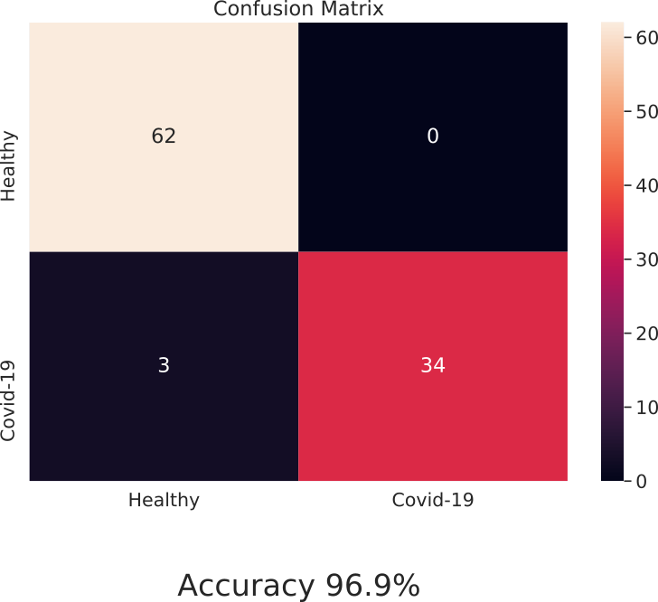

# COVID-19 CNN classifier on X-Ray images

Fine-tuned the pretrained on imagenet NASNet-Mobile on COVID-19 
<a href="https://github.com/ieee8023/covid-chestxray-dataset/">dataset</a> created from researchers on MILA institute.

<a href="https://drive.google.com/open?id=1bx0PokSApJgtkGkTbZVhM5vwfLe_ucqa/">Model available here</a> 

